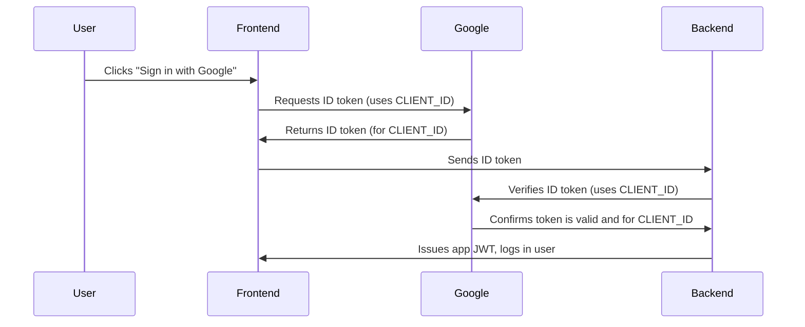

# Google Sign-In Flow (Frontend & Backend)

When using Google Sign-In, both the frontend and backend use the `GOOGLE_CLIENT_ID` for security and verification. Here's how the flow works:

## Summary
- The frontend uses `GOOGLE_CLIENT_ID` to request a Google ID token for your app.
- The backend uses the same `GOOGLE_CLIENT_ID` to verify the token is valid and was issued for your app (not another app).
- This ensures only users who signed in to your app can be authenticated by your backend.

## Diagram

---

**Why is this important?**
- The backend must check the `aud` (audience) claim in the token to ensure it was issued for your app.
- This prevents tokens from other apps from being accepted by your backend.

**Both the frontend and backend must use the same `GOOGLE_CLIENT_ID` for secure authentication.** 